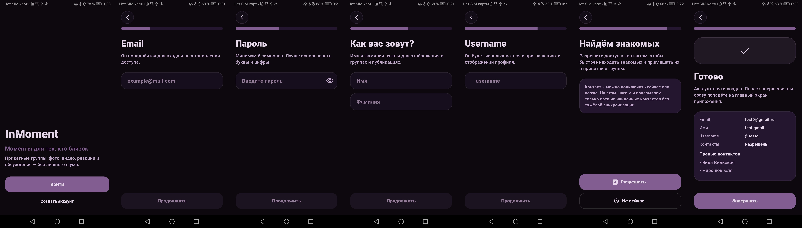
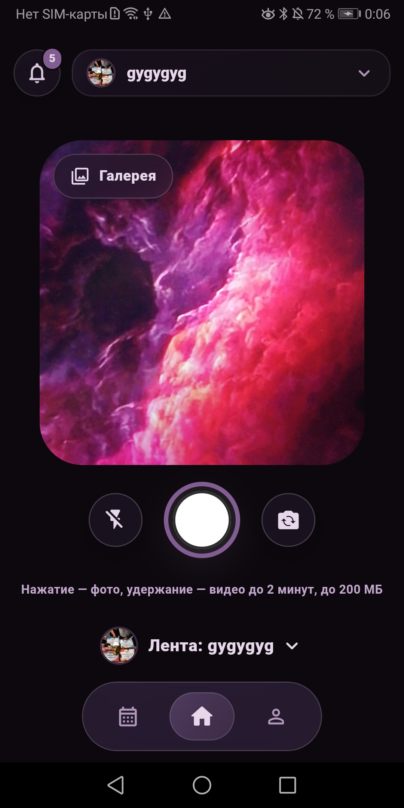
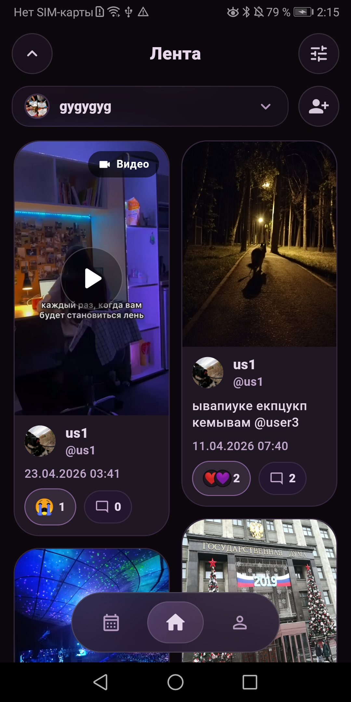
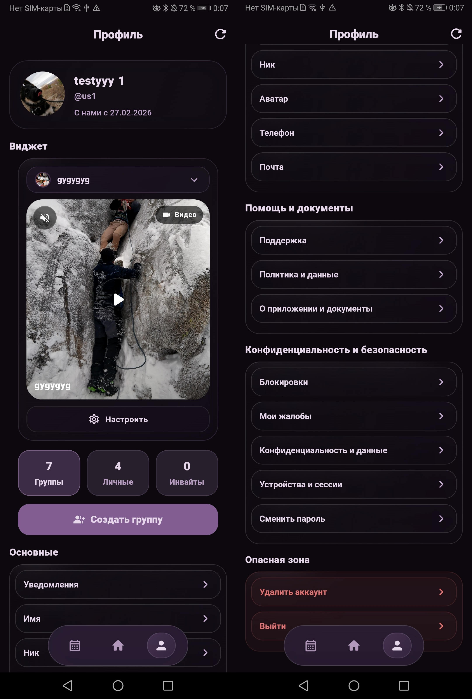
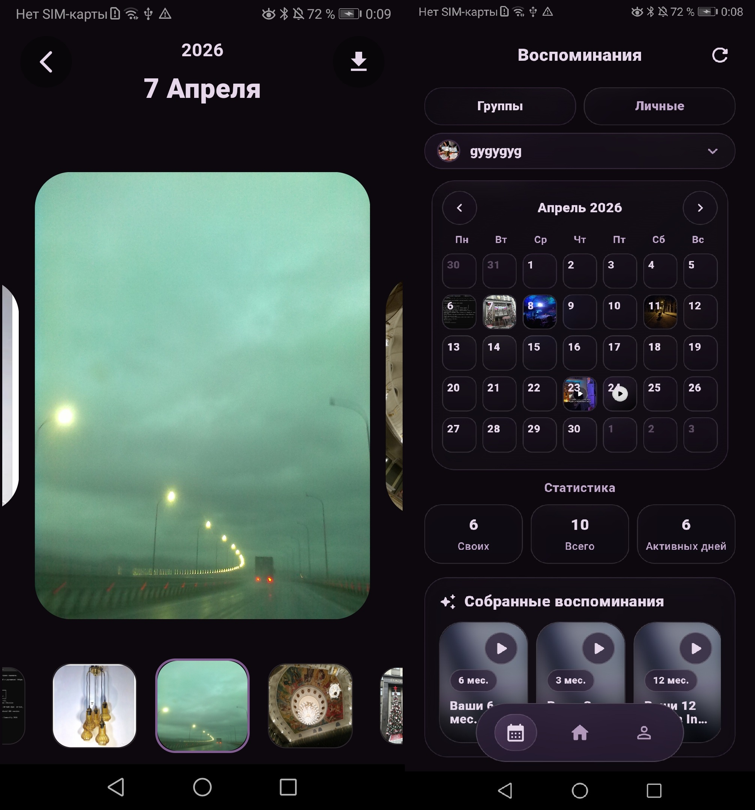
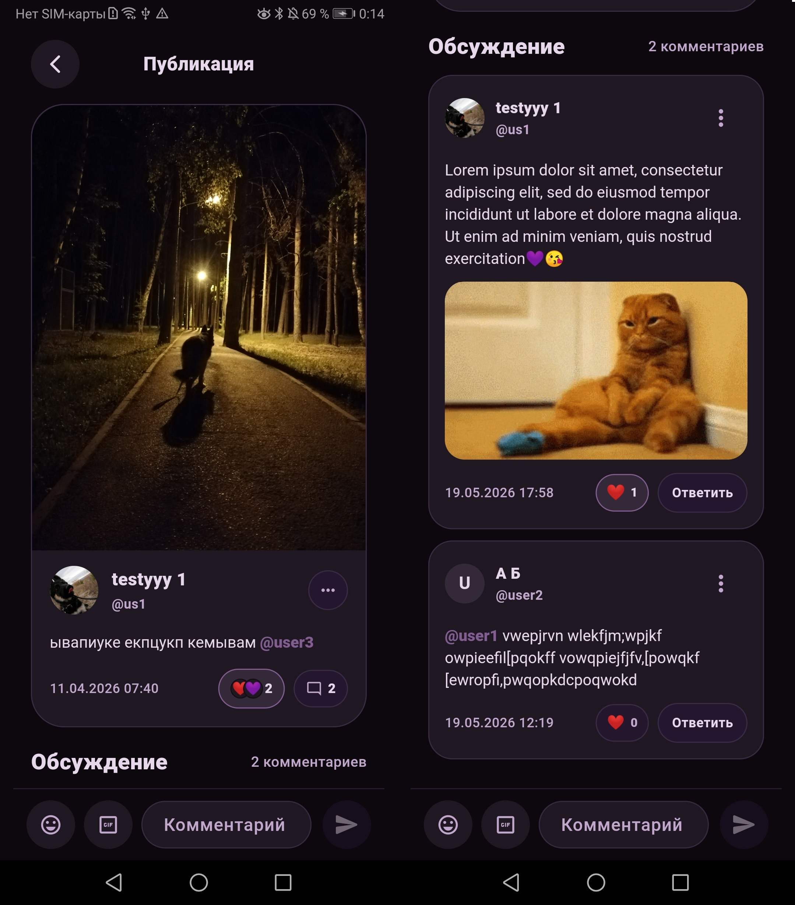
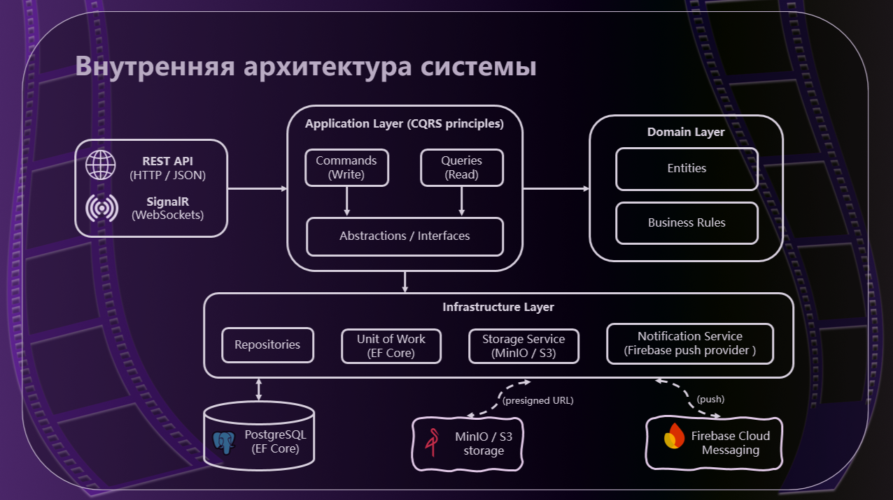
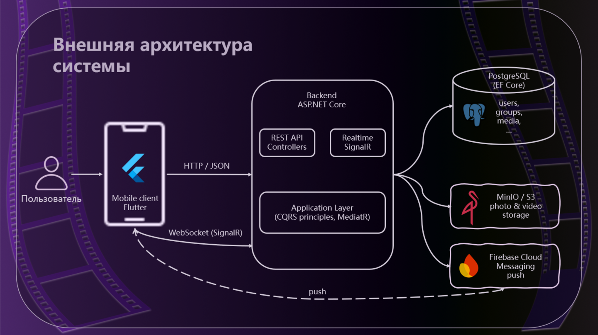

# InMoment


**InMoment** — мобильное приложение для обмена визуальным контентом в закрытых пользовательских группах.
Аналог Locket с расширенной системой групп, приватности и взаимодействия между пользователями.

> Приватные моменты — только для своих, без лишнего шума и открытых лент.

---

## 🚀  Возможности

- 📸 Публикация фото и видео
- 👥 Закрытые группы по приглашениям
- ❤️ Реакции и 💬 комментарии
- 🧠 Воспоминания и календарь активности
- 🔔 Уведомления
- 🛡️ Модерация и жалобы
- 📱 Виджет с последним моментом

---

## 📱 Demo

<p align="center">
  
</p>

Скриншоты ниже демонстрируют основные сценарии работы приложения.



<p align="center">
  
  
  
</p>

<p align="center">
  
  
</p>

---

## 🏗  Архитектура

### Внутренняя архитектура
(слои приложения и взаимодействие компонентов)


### Внешняя архитектура
(взаимодействие клиента, сервера и внешних сервисов)


Проект реализован с использованием **Clean Architecture**.

### Backend (.NET)

- ASP.NET Core / .NET 8
- Clean Architecture (Domain / Application / Infrastructure / API)
- Entity Framework Core
- JWT авторизация
- PostgreSQL
- Docker

### Frontend (Flutter)

- Flutter (Dart)
- Feature-based структура
- Dio (API)
- Firebase Messaging
- SignalR (realtime)

---

## 📦  Структура проекта

- **backend_InMoment/** — ASP.NET Core backend  
- **frontend_InMoment/** — Flutter клиент  
- **docs/** — документация и скриншоты  
---

## ⚙️ Запуск проекта

### Backend

```bash
cd backend_InMoment
docker compose up -d
```

Создать локальный файл: `backend_InMoment/InMoment/appsettings.Development.json`

Пример содержимого:

```json
{
  "ConnectionStrings": {
    "DefaultConnection": "your_db_connection"
  },
  "Jwt": {
    "Key": "your_secret_key"
  }
}
```

Запуск:

```bash
dotnet restore
dotnet ef database update --project InMoment.Infrastructure --startup-project InMoment/InMoment.API.csproj
dotnet run --project InMoment/InMoment.API.csproj
```

### Frontend

```bash
cd frontend_InMoment
flutter pub get
flutter run \
  --dart-define=INMOMENT_FLAVOR=development \
  --dart-define=INMOMENT_API_BASE_URL=http://localhost:5293
```
Для Android-эмулятора используйте: `http://10.0.2.2:5293`

---

## 🔐  Конфигурация

Файл `appsettings.Development.json` не хранится в репозитории и должен содержать:
- строку подключения к БД
- JWT ключ
- настройки интеграций (MinIO / SMTP / Firebase)

---

## 📌  Статус проекта

Проект разработан в рамках ВКР и доведён до состояния production-ready прототипа.

---

## 👤  Автор
- GitHub: [Ikari-Oomori](https://github.com/Ikari-Oomori)

## 📄  Лицензия

Проект создан в учебных целях (ВКР).
